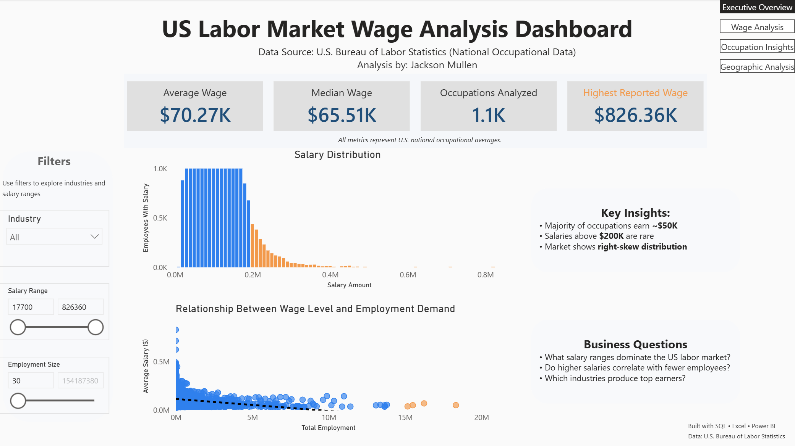
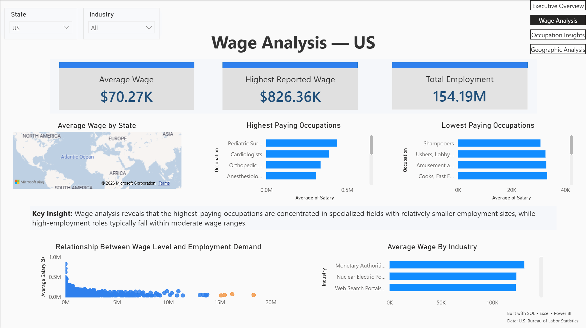
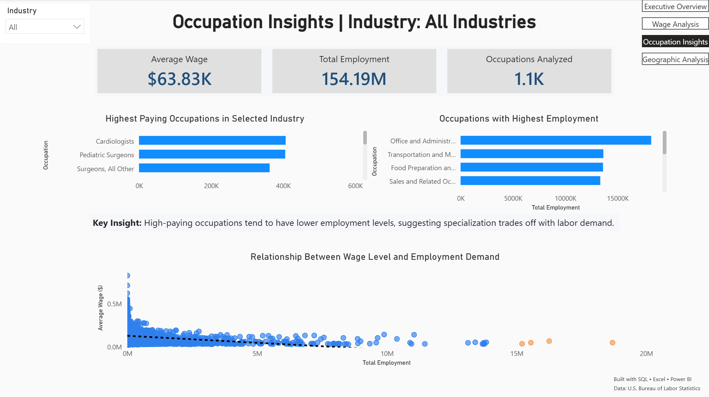
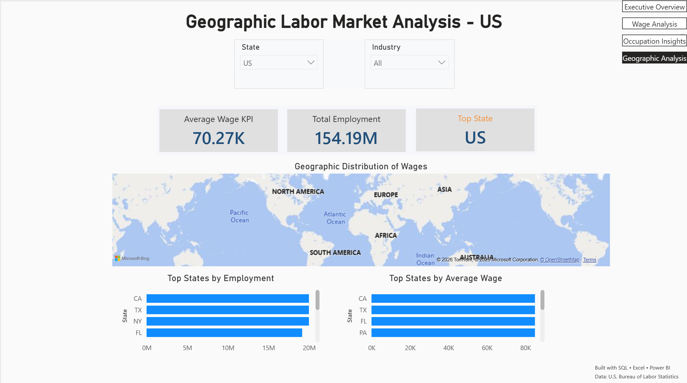

# U.S. Wage and Labor Market Analysis Dashboard

**Project Overview**

This project analyzes employment and wage data across industries, occupations, and geographic regions within the United States. The goal was to identify labor market trends and create an interactive Power BI dashboard for workforce and compensation analysis.

**Tools Used**

- PostgreSQL
- Power BI
- Excel
- DAX

**Data Preparation**

- Data cleaning
- Type conversion
- Null value removal
- Employment and wage standardization
- Analytical query development

**SQL Skills Demonstrated**

- Table creation
- Data cleaning
- Regular expressions
- Data type conversion
- Aggregations
- Grouping and sorting
- Business analysis queries

**Dashboard Features**

**Page 1: Executive Overview**

- Total employment
- Average wages
- Industry summary
- State filtering

**Page 2: Industry Analysis**

- Employment by industry
- Wage comparison
- Industry rankings
  
**Page 3: Occupation Analysis**

- Occupation wage analysis
- Employment distribution
- Wage vs employment relationship
- 
**Page 4: Geographic Analysis**

- State-level employment
- State-level wage comparisons
- Regional labor market trends

**Dashboard Screenshots**

**Key Insights**

- Healthcare and technical occupations exhibited the highest average wages.
- Employment concentration varied significantly across industries.
- Several states showed strong employment levels despite below-average wages.
- Wage growth was not always correlated with employment volume.
